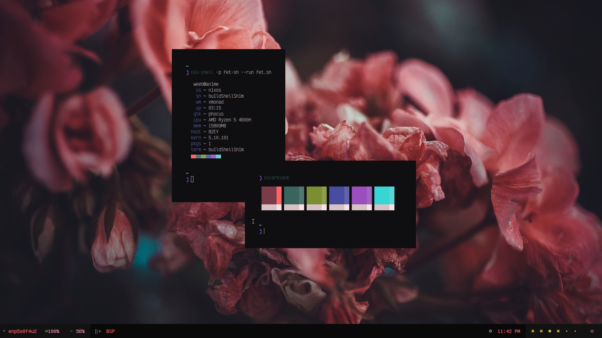

# NixOS Config
This is my config of NixOS
> Disclaimer: This is by no means a distribution or some sort of nix framework. It is just my private configuration and I can make no guarantees that it will work for everyone out of the box.



## How to Install
1. Boot into the Live installer.

2. Switch to root user: `sudo su -`

3. Do your partitions and mount your root partition to `/mnt`(reference: [Here](https://nixos.org/manual/nixos/stable/index.html#sec-installation-partitioning))

4. Clone this repo:
   ```sh
   sudo su -
   nix-shell -p git nixFlakes
   git clone https://github.com/Tanish2002/nixos-config /mnt/etc/nixos
   cd /mnt/etc/nixos
   
   # Remove my hardware config
   rm ./system/hardware-configuration.nix

   # Generate a config and copy the hardware configuration, disregarding the generated configuration.nix
   nixos-generate-config
   mv ./hardware-configuration.nix ./system/hardware-configuration.nix
   
   # Install this NixOS configuration with flakes
   nixos-install --root /mnt --flake '.#'
   ```

6. Then reboot, login as root, and change the password for your user using passwd

7. You're Good to go now but I recommend reading the Additional Notes below.

## Additional Notes
1. Remove 'ssh' import from `./home/dev/default.nix` because the keys I use are encrypted and shouldn't be of use to you anyway.

2. Most of my Config is dependant on [Home Manager](https://github.com/nix-community/home-manager). So you can probably set it up some other distro with some modifications using HM and nix.<br />
I did this because if one day I decide to go back to some other distro, I can easily install nix and HM and get most of my config easily.

1. This config is by no means perfect and if you find a bug or something that can be improved please do tell me.

2. Everything here was made keeping in mind that's it would be easy to understand for beginners. But if you still can't understand anything feel free to open a issue or contact me on [Discord](https://discordapp.com/users/402000088211128321)

## Configs/Sites I ~~Stole~~ Borrowed from:
+ [Nobbz](https://github.com/NobbZ/nixos-config) -> Special Thanks to them, They really helped me a lot on the nix discord server. 
+ [fortuneteller2k](https://github.com/fortuneteller2k/nix-config)
+ [LegendOfMiracles](https://github.com/legendofmiracles/dotnix)
+ [Github Search](https://github.com/search?q=language%3ANix&type=Code&ref=advsearch&l=Nix&l=) 
+ [Nix Wiki](https://nixos.wiki/wiki/NixOS)
+ [Discord Server](https://discord.com/invite/RbvHtGa)
